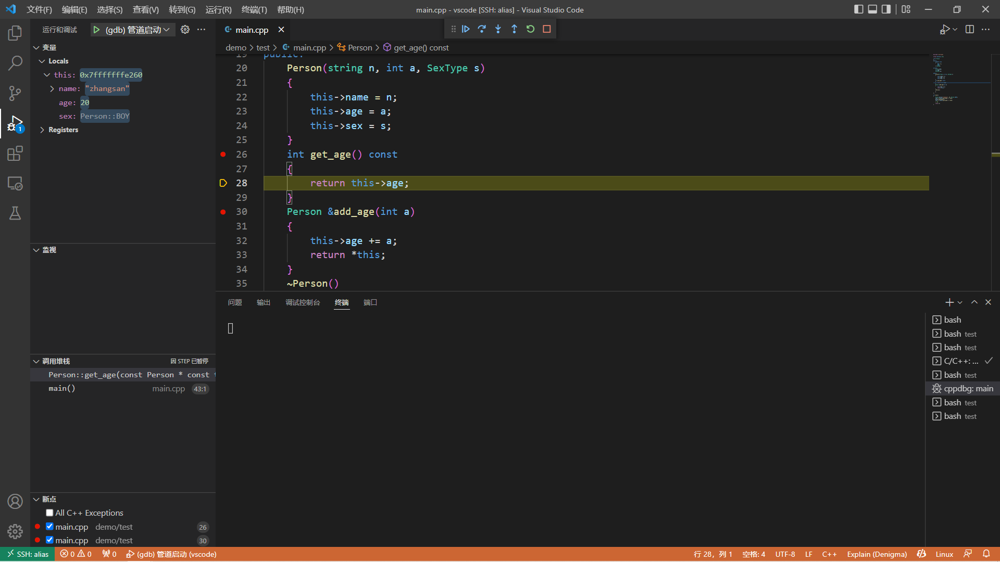
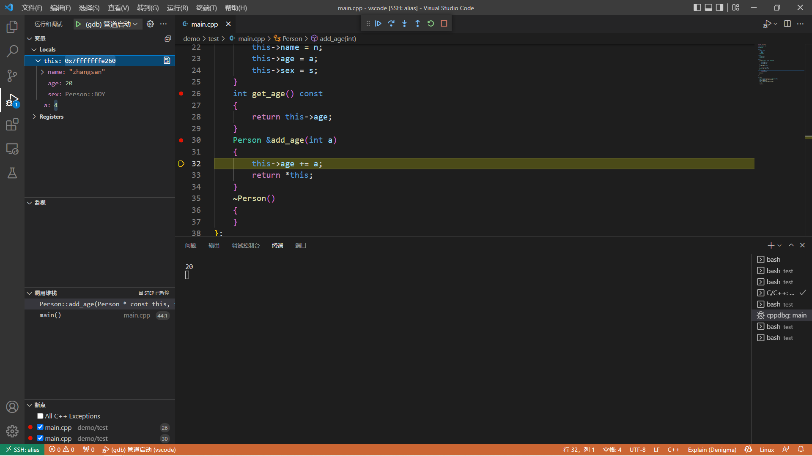
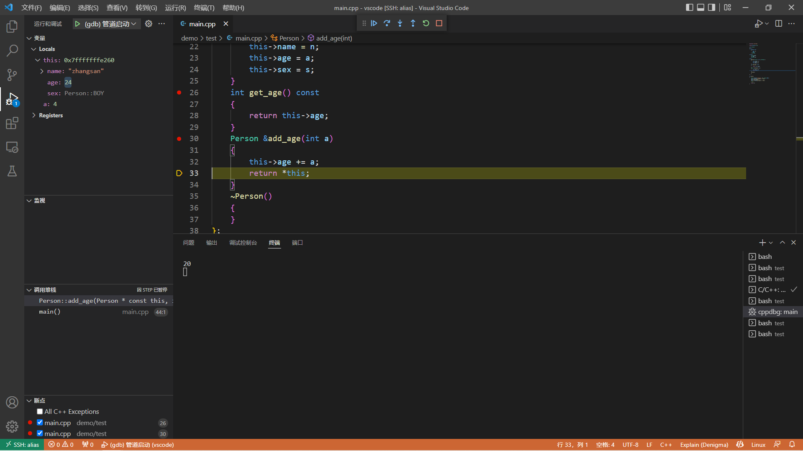

# this

---

## this 指针

对于 Python 来说有 ```self```，类比到 C++ 中就是 ```this``` 指针，首先来谈谈 ```this``` 指针的用处：

* 一个对象的 ```this``` 指针并不是对象本身的一部分，不会影响 ```sizeof``` (对象)的结果

* ```this``` 作用域是在类内部，当在类的非静态成员函数中访问类的非静态成员的时候，编译器会自动将对象本身的地址作为一个隐含参数传递给函数。也就是说，即使没有写上 ```this``` 指针，编译器在编译的时候也是加上 ```this``` 的，它作为非静态成员函数的隐含形参，对各成员的访问均通过this进行。

其次，```this``` 指针的使用：

* 在类的非静态成员函数中返回类对象本身的时候，直接使用 ```return *this```

* 当参数与成员变量名相同时，如 ```this->n = n```，不能写成 ```n = n```

另外，在网上大家会看到 ```this``` 会被编译器解析成 ```A *const```，```A const *```，究竟是哪一个呢？下面通过断点调试分析：

现有如下例子：

```cpp
#include <iostream>

using namespace std;

class Person
{
public:
    typedef enum
    {
        BOY = 0,
        GIRL
    } SexType;

private:
    string name;
    int age;
    SexType sex;

public:
    Person(string n, int a, SexType s)
    {
        this->name = n;
        this->age = a;
        this->sex = s;
    }
    int get_age() const
    {
        return this->age;
    }
    Person &add_age(int a)
    {
        this->age += a;
        return *this;
    }
    ~Person()
    {
    }
};

int main()
{
    Person person("zhangsan", 20, Person::BOY);
    cout << person.get_age() << endl;
    person.add_age(4);
    cout << person.get_age() << endl;
    // 20
    // 24
    return 0;
}
```

为了验证 ```this``` 指针是哪一个，现在在 ```add_age```，```get_age``` 处添加断点，运行后如下：







会发现编译器自动为我们加上 ```A* const```，而不是 ```A const *this```

会发现编译器把上述的 ```this```，变为 ```const A* const```，这个也能想到，因为这个函数是 ```const``` 函数，那么针对 ```const``` 函数，它只能访问 ```const``` 变量与 ```const``` 函数，不能修改其他变量的值，所以需要一个 ```this``` 指向不能修改的变量，那就是 ```const A*```，又由于本身 ```this``` 是 ```const``` 指针，所以就为 ```const A* const```

```this``` 在成员函数的开始执行前构造，在成员的执行结束后清除。上述的 ```get_age``` 函数会被解析成 ```get_age(const A * const this)```，```add_age``` 函数会被解析成 ```add_age(A* const this,int a)```。

在 C++ 中类和结构体是只有一个区别的：类的成员默认是 ```private```，而结构是 ```public```。```this``` 是类的指针，如果换成结构体，那 ```this``` 就是结构体的指针了。

---

## 总结

```this``` 作用于类内部，是非静态成员的隐含参数，代表着对象本身，不是对象的一部分

```this``` 会被编译器解析为 ```const A* const```

---
